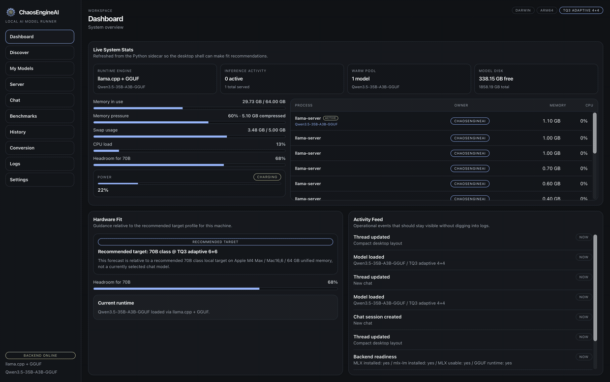

<p align="center">
  
</p>

<h1 align="center">ChaosEngineAI</h1>

<p align="center">
  <strong>The local AI model runner for serious tinkerers.</strong><br/>
  Discover, convert, serve, chat with, benchmark, and generate images from open-weight models — all on your own machine.
</p>

<p align="center">
  
  
  
  
  
  
</p>

> ⚠️ **Work in progress.** ChaosEngineAI is under active development. Expect rough edges, breaking changes between versions, and features that appear (and occasionally disappear) from one release to the next. Feedback and issue reports are very welcome.

<p align="center">
  
</p>

---

## Why ChaosEngineAI

ChaosEngineAI is a desktop control plane for running large language models locally. It pairs a fast Tauri + React shell with a Python backend that drives `llama.cpp`, Apple MLX, and (optionally) vLLM, so you get a single window for everything from "I want to try this Hugging Face model" to "show me tokens-per-second across three quantizations on this exact prompt."

- **One app, the whole pipeline.** Discover models, download them, convert to MLX, load into a warm pool, serve over an OpenAI-compatible API, chat, benchmark, and generate images.
- **Real local performance.** First-class support for `llama.cpp` GGUF and Apple Silicon MLX for LLMs, plus local Stable Diffusion for image generation.
- **Pluggable cache compression.** Native f16 cache out of the box, with five KV cache compression strategies — [RotorQuant](https://github.com/scrya-com/rotorquant), [TriAttention](https://github.com/WeianMao/triattention), [TurboQuant](https://pypi.org/project/turboquant-mlx/), and [ChaosEngine](https://github.com/cryptopoly/ChaosEngine). Install supported backends into the repo-local runtime, restart, and they appear in the UI.
- **Speculative decoding.** DFlash and DDTree accelerate generation by 3-5x with zero quality loss. A small draft model proposes tokens; the target verifies them in one forward pass. DDTree extends this with tree-structured candidate exploration for even higher acceptance rates.
- **Hybrid local + remote workflows.** Scan multiple local model directories, convert Hugging Face checkpoints to MLX, or point the app at remote OpenAI-compatible providers when you want a cloud fallback.
- **Per-chat runtime profiles.** Each chat session remembers the exact model, cache strategy, quantization bits, context length, and speculative decoding settings used — switch between configurations without losing track.
- **Prompting + evaluation.** Built-in prompt templates, side-by-side compare mode, and benchmark modes for throughput, perplexity, and task accuracy keep experimentation in one place.
- **Agent tools.** Built-in web search, calculator, code executor, and file reader tools that models can call during conversations.
- **Built for power users.** Live runtime telemetry, structured logs, side-by-side benchmark history with model filtering and red/green delta comparisons, and granular launch preferences.
- **Polished, fast UI.** A focused dark workspace that gets out of the way and never blocks on the backend.
- **Self-updating.** Ships with a signed in-app updater — no more manual re-downloads when a new release drops.

---

## Feature Highlights

- 🧭 **Discover** open-weight models from curated catalogs and pull them with one click
- 💾 **My Models** library with format, size, context, and modified-date sorting
- 🔁 **Conversion** pipeline that turns Hugging Face checkpoints into MLX (Apple Silicon)
- 🚀 **Server** mode exposing an OpenAI-compatible REST API for your other tools
- 💬 **Chat** with the loaded model, including document attachments with inline citations, image inputs for vision-capable models, tool calls, and collapsible reasoning traces
- ⚖️ **Compare mode** to stream the same prompt through two models side-by-side with separate runtime settings and metrics
- 🗂️ **Prompt Library** with built-in starter templates plus searchable tags, categories, CRUD, and one-click apply-to-chat
- 🎨 **Image Discover** curated catalog of Stable Diffusion models with one-click download from Hugging Face
- 🖼️ **Image Models** library showing installed image models ready for generation
- 🖌️ **Image Studio** for prompt-based image generation with aspect ratio, quality presets, and negative prompts
- 🏛️ **Image Gallery** to browse, filter, and reuse saved outputs — compare models and re-run with the same settings
- 📊 **Benchmarks** with throughput, perplexity, and task-accuracy modes plus a history view for A/B comparisons
- 📜 **Logs** streaming straight from the Python runtime
- ⚙️ **Settings** for data directories, Hugging Face tokens, remote providers, integrations, default launch preferences, and runtime tuning
- ☁️ **Remote providers** for OpenAI-compatible APIs, with keys stored locally and masked in the UI
- 📁 **Model directories** for custom stores, Ollama, LM Studio, or shared model paths
- 🧠 **Warm pool** keeps recently-used models hot so subsequent loads are instant
- 🔄 **In-app updates** — signed, verified, cross-platform. Launch, prompt, relaunch.
- 🍎 **Notarized macOS builds** with a fully embedded, hardened-runtime Python runtime
- 🐧 **AppImage + .deb** for Linux, **NSIS installer** for Windows
- 🎚️ **Adaptive runtime controls** for balancing speed, memory footprint, and quality on local hardware
- 📈 **Live telemetry** on the dashboard: backend health, engine, loaded model, hardware, warm-pool state
- 🔮 **DFlash speculative decoding** for 3-5x faster generation with zero quality loss (Qwen3, Qwen3.5, LLaMA 3.1, gpt-oss, Kimi families)
- 🌳 **DDTree** tree-based speculative decoding — explores multiple draft paths in parallel for higher acceptance rates
- 🔧 **Agent tools** — web search, calculator, code executor, and file reader for tool-augmented conversations
- 🎓 **Fine-tuning** with LoRA adapter support for MLX models
- 🧩 **Plugin system** with 5 extension types: cache strategies, inference engines, tools, model sources, and post-processors
- 🔌 **Integrations** with copy-paste connection snippets for Continue.dev, Goose, Cursor, and Claude Code via the local API

---

## Complete Feature Map

### Local runtimes & serving

- `llama.cpp` GGUF, Apple MLX, optional vLLM, plus remote OpenAI-compatible providers as fallbacks
- OpenAI-compatible local server with preferred port, optional LAN exposure, auto-start, live request counts, active connections, and copyable curl test commands
- Warm-pool activation so recently used runtime profiles can be re-activated instantly
- Signed in-app updates and bundled desktop runtimes for release builds

### Chat, prompting & agent workflows

- Multi-thread chat with pinned sessions, persistent history, inline thread renaming, and per-thread runtime memory
- Document uploads with chunked retrieval, inline citations, and per-session document management
- Image attachments for vision-capable models
- Optional thinking mode with collapsible reasoning traces and cleanup of raw reasoning tokens
- Tool-augmented conversations with `web_search`, `calculator`, `code_executor`, and `file_reader`
- Side-by-side compare mode that streams the same prompt through two models with independent runtime settings and metrics
- Prompt Library with five built-in starter templates, search, tagging, categories, CRUD, and one-click apply-to-chat

### Models, discovery & media

- Curated text and image catalogs with capability filters plus direct Hugging Face inspection
- Multiple local model directories, including custom paths, Ollama, LM Studio, or shared model stores
- Download management with progress, cancel/delete, and a metadata-rich local library
- Apple Silicon conversion from Hugging Face or local checkpoints to MLX with live progress
- Full local image workflow: Image Discover, Image Models, Image Studio, Image Gallery, preload/unload controls, seed reuse, and saved artifact metadata
- Hugging Face token management for gated model access

### Performance, evaluation & extensibility

- DFlash and DDTree speculative decoding with auto-resolved draft models and graceful fallback
- Five cache strategies: native f16, RotorQuant, TriAttention, TurboQuant, and ChaosEngine
- Runtime controls for cache bits, FP16 layers, fused attention, fit-in-memory behavior, context length, and speculative tree budget
- Benchmark modes for throughput, perplexity, and task accuracy (MMLU / HellaSwag), with persistent history, scatter plots, and diff tables
- LoRA adapter discovery plus fine-tuning hooks for local training workflows
- Plugin system spanning cache strategies, inference engines, tools, model sources, and post-processors
- Live logs, backend health, hardware telemetry, and orphaned-worker cleanup reporting

### Settings & integrations

- Data-directory relocation with migration/copy support
- Remote-provider configs stored locally with masked keys and HTTPS validation
- Integration snippets for Continue.dev, Goose, Cursor, and Claude Code through the local OpenAI-compatible API

---

## A Tour of the App

### Dashboard — *System overview*


The launchpad. Surfaces backend health, the engine in use, the currently loaded model, hardware (platform, arch, memory), and quick stats from the warm pool. Big colored badges tell you instantly whether the runtime is online and what cache mode it will use on the next launch.

### Discover — *Browse and download AI models*


Browse curated model families with capability tags (chat, coding, vision, reasoning, tools, multilingual, video, thinking). Expand a family to see every variant with its format, parameter count, and quant level, then queue downloads. Filter by format and capability across the whole catalog.

### Model Selection — *Configure and launch*


The launch modal. Pick a variant, set context length, choose the engine, and tune runtime strategy knobs in one place, pre-populated from your defaults.

### My Models — *Models on this machine*


Your local library. Sort by name, format, size, context length, or last-modified date. Each entry shows where it lives on disk, its quant scheme, and a one-click **Launch** that opens the launch modal with the right defaults pre-populated.

### Image Discover — *Browse and download image models*


Curated catalog of local image models. Discover Stable Diffusion models optimized for ChaosEngineAI, scout new releases from Hugging Face, and install them with one click. Filter by compatibility tags and see metadata at a glance.

### Image Models — *Installed image models*


Your installed image model library. See which Stable Diffusion models are ready for generation — each card shows size, diffusion pipeline, resolution, and a one-click **Generate** to jump straight into Image Studio.

### Image Studio — *Generate images from text*


Prompt-based image generation with full control. Choose a model, set aspect ratio and quality presets (square, portrait, landscape, wide), write positive and negative prompts, and generate. Recent outputs appear in the right panel with metadata and re-run options.


Live progress while the diffusion pipeline runs — step-by-step denoising visualization, elapsed time, and a running status log.


Completed image with full generation metadata — model, prompt, seed, steps, resolution, and timing. Open, reveal on disk, clone settings, or save directly from the completion modal.

### Image Gallery — *Browse and reuse generated images*


All your generated images in one place. Search by prompt, model, or runtime; filter by frame size and sort order. Each card shows the source model, generation settings, and quick actions to re-run with the same seed or open in Image Studio.

### Chat — *Local AI chat*


A focused chat surface with multi-thread sessions in the left rail, pinned threads, document and image attachments, inline citations, tool-call cards, collapsible reasoning traces, and inline thread renaming. Threads persist across launches, remember the model/runtime profile that produced them, and can be reloaded directly from the thread toolbar.

### Server — *OpenAI-compatible local API*


Start, stop, and inspect a local OpenAI-compatible HTTP server backed by the loaded model. Shows the bind address, warm-pool entries, request count, active connections, LAN exposure, preferred port, auto-start controls, and a remote-test panel with copyable curl commands for `/health`, `/models`, and `/chat/completions`.

### Benchmarks — *Run a new benchmark*


Configure a benchmark run: choose a model, throughput prompt preset or eval dataset, token budget, and decoding parameters, then watch live progress as the runner streams tokens-per-second, time-to-first-token, memory usage, or eval metrics.


Live progress while a run is in flight — token/sec, TTFT, current prompt, and memory pressure all update in real time.


Final report card: throughput, latency percentiles, generation samples, and the exact run parameters — saved automatically to history.

### History — *Compare saved runs*


Every benchmark you've ever run, side-by-side. Pick two runs and the page diffs them across throughput, latency, and quality metrics — perfect for proving that your new quant actually pays its keep.

### Conversion — *Convert models to MLX format* (macOS only)


Apple Silicon only. Point at a Hugging Face checkpoint or local directory and convert it to MLX with optional runtime-specific compression settings. A conversion picker surfaces eligible source models.


Layer-by-layer live progress while the conversion runs — bit budget per block, memory footprint, and a running log tail.

### Prompt Library — *Reusable system prompts*

Search, create, edit, tag, and delete reusable prompt templates, including five built-in starter personas. Any template can be applied to Chat with one click so you can switch between coding, summarization, translation, and other system-prompt presets without copy-paste.

### Plugins — *Extensions and plugin system*

Inspect built-in and external plugins across cache strategies, inference engines, tools, model sources, and post-processors. Plugins can be enabled or disabled from the UI, and external plugins are discovered from the app's plugin directory.

### Logs — *Runtime events*


A live tail of the backend log stream — load events, server requests, errors, and runtime warnings — with level filtering. The first place to look when something feels off.

### Settings — *Directories and defaults*


Configure model and cache directories, remote-provider fallbacks, Hugging Face tokens for gated models, data-directory migration, integration snippets for external tools, default launch preferences (cache strategy, FP16 layers, fused attention, context tokens, fit-in-memory toggle), and advanced runtime knobs. Every default in this panel is reused as the starting state for the launch modal.

---

## Download & Install

Head to the [Releases](https://github.com/cryptopoly/ChaosEngineAI/releases/latest) page for signed builds:

| Platform | File | Notes |
|---|---|---|
| **macOS** (Apple Silicon) | `ChaosEngineAI_*_aarch64.dmg` | Signed + notarized |
| **Linux** | `ChaosEngineAI_*_amd64.AppImage` | Portable, in-app updates supported |
| **Linux** (Debian/Ubuntu) | `ChaosEngineAI_*_amd64.deb` | Install via `dpkg`, update via apt |
| **Windows** | `ChaosEngineAI_*_x64-setup.exe` | Unsigned for now — SmartScreen will warn on first run |

From v0.4.21 onward, every install auto-updates from GitHub Releases on launch. Updates are cryptographically signed.

---

## Quick Start (from source)

Prereqs: Rust toolchain, Node 20+, Python 3.11+, and (on macOS) Xcode command-line tools.

```bash
# 1. Install JS dependencies

npm install

# 2. Stage the bundled Python runtime + llama.cpp binaries into src-tauri/
npm run stage:runtime

# 3. Launch the desktop app in dev mode (Tauri shell + Vite HMR)
npm run tauri:dev
```

That's it — the Python backend is spawned by the Tauri shell, the React UI hot-reloads, and you can start exploring.

---

## Architecture

ChaosEngineAI is three cooperating layers:

```
┌─────────────────────────────────────────────────────────┐
│  Tauri shell  (Rust)                                    │
│  ├─ React + TypeScript UI  (src/)                       │
│  ├─ In-app updater (signed releases from GitHub)        │
│  └─ Spawns and supervises the Python backend            │
└─────────────────────────────────────────────────────────┘
                          │  HTTP  /  IPC
                          ▼
┌─────────────────────────────────────────────────────────┐
│  Python backend  (backend_service/)                     │
│  ├─ Workspace + library + warm pool state               │
│  ├─ OpenAI-compatible HTTP server                       │
│  ├─ Engine adapters + plugin system                     │
│  └─ DFlash / DDTree speculative decoding                │
└─────────────────────────────────────────────────────────┘
                          │
          ┌───────────────┼───────────────┐
          ▼               ▼               ▼
  ┌──────────────┐ ┌──────────────┐ ┌──────────────┐
  │  llama.cpp   │ │ MLX runtime  │ │   vLLM       │
  │  (GGUF)      │ │ (Apple Si)   │ │ (Linux/CUDA) │
  └──────────────┘ └──────────────┘ └──────────────┘
```

- **`src/`** — React 18 + TypeScript UI. Single-window workspace with a sidebar nav covering LLM and image generation screens.
- **`src-tauri/`** — Tauri 2 Rust shell + bundled runtime.
- **`backend_service/`** — Python service that owns model lifecycle, the warm pool, the OpenAI-compatible API, the benchmark runner, and speculative decoding (DFlash + DDTree).
- **`backend_service/routes/`** — FastAPI routes for chat, prompts, compare mode, benchmarks, plugins, images, server controls, and settings.
- **`compression/`** — Pluggable cache/compression strategy system. Ships with native f16 and optional adapters for [RotorQuant](https://github.com/scrya-com/rotorquant), [TriAttention](https://github.com/WeianMao/triattention), [TurboQuant](https://pypi.org/project/turboquant-mlx/), and [ChaosEngine](https://github.com/cryptopoly/ChaosEngine).
- **`dflash/`** — DFlash speculative decoding integration: draft model registry, fuzzy matching for quantized variants, MLX and vLLM backend detection.

---

## Cache Compression Backends

ChaosEngineAI uses a pluggable cache strategy system. Out of the box, models run with the native f16 KV cache (no compression). Install any of the optional backends below and they automatically appear in the **Cache Strategy** selector in the launch modal — no configuration required.

| Backend | Install | Bits | Platforms | Description |
|---|---|---|---|---|
| **Native f16** | Built-in | — | All | Full-precision KV cache. Maximum quality, no compression. |
| **[RotorQuant](https://github.com/scrya-com/rotorquant)** | `./.venv/bin/python3 -m pip install turboquant` | 3-4 | CUDA, Metal (via llama.cpp fork) | IsoQuant (4D quaternion) and PlanarQuant (2D Givens) rotation-based cache compression. |
| **[TriAttention](https://github.com/WeianMao/triattention)** | `./.venv/bin/python3 -m pip install triattention vllm` | 1-4 | Linux + CUDA only (via vLLM) | Transparent KV cache compression integrated into vLLM's scheduler. Not supported on macOS. |
| **[TurboQuant](https://pypi.org/project/turboquant-mlx/)** | `./.venv/bin/python3 -m pip install turboquant-mlx` | 1-4 | Apple Silicon (MLX), llama.cpp | Experimental. The current PyPI package does not yet expose the MLX adapter hooks ChaosEngineAI expects, so this option may remain disabled in the current build. |
| **[ChaosEngine](https://github.com/cryptopoly/ChaosEngine)** | `Bundled automatically in desktop builds when vendor/ChaosEngine is present; otherwise ./.venv/bin/python3 -m pip install -e /path/to/ChaosEngine` | 2-8 | PyTorch + llama.cpp or vLLM | PCA-based decorrelation, channel truncation, and hybrid quantization. Not published on PyPI. |

Install optional backends into the backend runtime (`./.venv/bin/python3 -m pip install ...`), then restart ChaosEngineAI. TriAttention is Linux/CUDA only, the current PyPI `turboquant-mlx` package may still leave TurboQuant disabled in the current build, and ChaosEngine can now be bundled directly into desktop builds by checking out `vendor/ChaosEngine` (or setting `CHAOSENGINE_VENDOR_PATH`) before `npm run stage:runtime`. Source/dev installs can still use the local editable install from GitHub.

The system is designed so new compression methods can be added as single-file adapters in `compression/` without touching any other code.

---

## Speculative Decoding

ChaosEngineAI ships with two speculative decoding modes that accelerate generation by 3-5x with zero quality loss.

### DFlash

A small draft model proposes a block of tokens; the target model verifies them in a single forward pass. Accepted tokens are committed instantly; rejected tokens fall back to standard autoregressive generation.

**Supported model families:** Qwen3 (4B, 8B), Qwen3.5 (4B-35B), Qwen3-Coder (4B, 8B), LLaMA 3.1 8B, gpt-oss (20B, 120B), Kimi-K2.5.

**Requirements:** Apple Silicon + `dflash-mlx`, or Linux/CUDA + `dflash`. Native f16 cache (no compression). A compatible draft checkpoint is auto-resolved from the [z-lab](https://huggingface.co/z-lab) collection.

### DDTree (Diffusion Draft Tree)

Extends DFlash with tree-structured candidate exploration. Instead of verifying a single draft path, DDTree builds a tree of top-k candidates using a max-probability heap and verifies the entire tree in one forward pass with a tree-structured attention mask. The longest verified path is accepted, yielding higher acceptance rates than linear DFlash.

**Configuration:** Set the **tree budget** slider (0-64) in Runtime Controls when DFlash is enabled. Budget 0 = linear DFlash; higher budgets explore more branches at the cost of additional memory for the attention mask.

Both modes fall back gracefully: DDTree falls back to linear DFlash on failure, and DFlash falls back to standard generation.

---

## Image Generation

ChaosEngineAI includes a full local image generation pipeline powered by Hugging Face Diffusers.

| Model | Provider | Speed | Resolution |
|---|---|---|---|
| **FLUX.1 Schnell** | Black Forest Labs | ~4s | 1024x1024 |
| **FLUX.1 Dev** | Black Forest Labs | ~7s | 1024x1024 |
| **Stable Diffusion 3.5 Medium** | Stability AI | ~6s | 1024x1024 |
| **SD 3.5 Large Turbo** | Stability AI | ~2s | 1024x1024 |

Discover and download models from the **Image Discover** tab, generate from prompts in **Image Studio** with aspect ratio, quality presets, negative prompts, and seed control, then browse and reuse outputs in **Image Gallery**.

---

## Building a Release

Releases are tag-driven. Push `vX.Y.Z` and the GitHub Actions release workflow builds signed bundles for macOS, Linux, and Windows in parallel, generates the `latest.json` updater manifest, and stages a draft release.

```bash
# locally, if you want to cut a build by hand:

npm run stage:runtime:release
npm run tauri:build
```

Release artifacts land in `src-tauri/target/release/bundle/`.

For an unsigned local macOS app + DMG without Apple signing/notarization or Tauri updater signing configured:

```bash

npm run release:macos -- --skip-sign --skip-notarize
```

That writes the local app + DMG to `releases/macos/`.

---

## Project Layout

```
ChaosEngineAI/
├── src/                  React UI (App.tsx is the workspace shell)
├── src-tauri/            Tauri Rust shell + bundled runtime
├── scripts/              Build, release + runtime staging scripts
├── backend_service/      Python backend (engine adapters + HTTP server)
├── compression/          Pluggable cache/compression strategy adapters
├── dflash/               DFlash/DDTree speculative decoding integration
├── vendor/ChaosEngine/   ChaosEngine compression (git submodule)
├── tests/                Backend integration tests
├── Screenshots/          UI screenshots used by this README
├── docs/                 Tour GIF + supporting docs
└── ChaosEngineAI_AppIcon.svg
```

---

## License & Credits

ChaosEngineAI is currently distributed under the Apache-2.0 license. See [`LICENSE`](./LICENSE).

See [`THIRD_PARTY_NOTICES.md`](./THIRD_PARTY_NOTICES.md) for optional third-party dependency notes.

Built on the shoulders of [`llama.cpp`](https://github.com/ggerganov/llama.cpp), [Apple MLX](https://github.com/ml-explore/mlx), [Tauri](https://tauri.app/), and the broader open-weights community.
